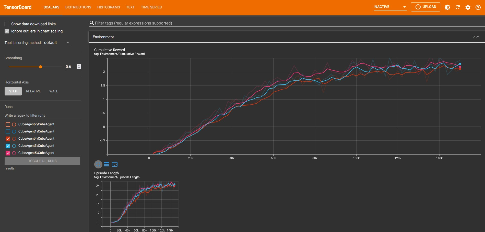

# Jumper excercise ml-agents
Gemaakt door: Brent Van Daele

## Uitleg
Deze oefening is de basis om aan te leren hoe een ml-agent getraind kan worden voor complexere doeleinden. Zo zal de agent in plaats van enkel te wandelen, zoals in vorige opgaven, nu moeten springen over aankomende obstakels. Het basisidee bestaat eruit dat de agent moet springen over een obstakel dat uit één richting komt en een variërende snelheid kan hebben. Als uitbereiding heeft deze versie dat de agent over een obstakel moet sprongen dat uit 2 richtingen kan komen, ook met variërende snelheid.

## Uitvoering
Om tot het gewenst resultaat te bekomen zullen volgende stappen doorlopen worden.

### Omgeving
Om te starten wordt er een omgeving aan gemaakt in Unity waar er een plane als floor wordt toegevoegd gevolgd door 3 kubussen, namelijk de agent en twee obstakel. Hierna wordt er een kleur toegewezen om de objecten uit elkaar te houden en worden de obstakels naar de juiste grootte gebracht.


### Scripts
Volgende scripts worden gebruikt om de ml-agent tot leven te wekken. Extra info kwam van eerdere labo’s en gegeven documentatie (Van Daele, 2025) (Peeters, 2025).

#### Obstakel
In deze code wordt in de Start functie het object op de juiste plaats gezet en op de juiste grootte. Ook wordt hier een random snelheid gekozen tussen 2 bepaalde waarden die meegegeven kunnen worden. In de Update-functie wordt het object verplaatst met de gekozen snelheid tot het einde bereikt van de floor plane. Dit geld voor beide obstakels.

```C#
using UnityEditor.Experimental.GraphView;
using UnityEngine;

namespace Assets.Scripts
{
    public class ObstacleX : MonoBehaviour
    {
        [SerializeField] float obstacleSpeedMin = 0.001f;
        [SerializeField] float obstacleSpeedMax = 0.5f;
        private float obstacleSpeed;

        // Start is called once before the first execution of Update after the MonoBehaviour is created
        void Start()
        {
            obstacleSpeed = Random.Range(obstacleSpeedMin, obstacleSpeedMax);
            this.transform.localPosition = new Vector3(-3.0f, 0.5f, 0f);
            this.transform.localScale = new Vector3(1, 1, 8);
        }

        // Update is called once per frame
        void Update()
        {
            this.transform.localPosition += Vector3.right * obstacleSpeed;

            if (this.transform.localPosition.x >= 5.0f)
            {
                Destroy(this.gameObject);
            }
        }
    }
}
```

#### Agent
De code die hier volgt is de code voor de agent. Een klein deel hiervan komt van chatGPT (chatgpt, 2025), namelijk de lijn "physics.raycast". Hier zal de prefab van het obstakel voor de episode geïnstantieerd worden in OnEpisodeBegin. Het obstakel wordt random gekozen van een lijst van obstakels. Vervolgens wordt de agent op de begin positie gezet en al zijn snelheden gereset. Ook wordt de rigidbody opgeslagen in variabele rb voor gemakkelijker gebruik in latere code.


```C#
using Unity.MLAgents;
using UnityEngine;
using Unity.MLAgents.Sensors;
using Unity.MLAgents.Actuators;

namespace Assets.Scripts
{
    public class CubeAgent : Agent
    {
        private Rigidbody rb;
        [SerializeField] GameObject[] obstaclePrefabs;
        private GameObject obstacle;

        public override void OnEpisodeBegin()
        {
            obstacle = Instantiate(obstaclePrefabs[Random.Range(0, obstaclePrefabs.Length)]);
            rb = this.GetComponent<Rigidbody>();
            rb.linearVelocity = Vector3.zero; // Reset velocity to prevent weird physics
            rb.angularVelocity = Vector3.zero;
            this.transform.localPosition = new Vector3(0, 0.6f, 0); // Reset position
            this.transform.rotation = Quaternion.LookRotation(Vector3.forward);

        }
```

In de CollectObservations functie worden alle observaties toegevoegd die de agent mag weten. Wat in deze situatie enkel zijn positie en spring snelheid is.
```C#
        public override void CollectObservations(VectorSensor sensor)
        {
            sensor.AddObservation(this.transform.localPosition);
            sensor.AddObservation(rb.linearVelocity.y);
        }
```

In de OnActionReceived functie wordt de logica beschreven die de agent moet uitvoeren. Hier wordt eerst de input van de agent opgehaald en dan gevolgd door het correct roteren (latere functie) van de agent om juist gericht naar de obstakels te kijken. Vervolgens wordt de jump actie uitgeschreven. Als de agent op de grond is (ook externe functie) en de ml aanduidt om te springen zal er een kleine kracht toegevoegd worden aan de rigidbody van de agent. Hier zal ook de afstand van het object bepaald worden om een goede reward of punishment te kunnen geven, wat via raycasting gebeurt. Ten slotte wordt hier ook de reward en punishment gegeven voor een succesvolle sprong (object == null) en als de agent van het platform valt.
```C#
        public override void OnActionReceived(ActionBuffers actions)
        {
            float jumpAction = actions.ContinuousActions[0];

            RotateCorrectly();

            if (IsGrounded() && jumpAction > 0.0f)
            {
                rb.AddForce(Vector3.up * jumpAction, ForceMode.Impulse);

                // get distance via raycasting
                Physics.Raycast(this.transform.position, this.transform.forward, out RaycastHit hitFront, 10f);

                if (hitFront.distance < 1.5f)
                {
                    SetReward(0.5f); // Reward for correctly jumping close to an obstacle
                }
                else
                {
                    SetReward(-0.4f); // Punish to much jumping
                }
            }

            // If the obstacle is destroyed, reward the agent for completing the task
            if (obstacle == null)
            {
                SetReward(2.0f);
                EndEpisode();
            }

            // If the agent falls down, penalize it
            if (transform.localPosition.y <= -0.5f)
            {
                SetReward(-1.0f);
                Destroy(obstacle);
                EndEpisode();
            }
        }
```
Wanneer de agent collides met het obstakel zal deze sprong ook als gefaald worden beschouwd en zal de agent dus een punishment krijgen.
```C#
        public void OnCollisionEnter(Collision collision)
        {
            Debug.Log("Collision detected with: " + collision.gameObject.name);

            if (collision.gameObject.CompareTag("obstacle"))
            {
                Debug.Log("Collided with an obstacle! Ending episode.");
                SetReward(-1.0f);
                Destroy(obstacle);
                EndEpisode();
            }
        }
```
De Heuristic functie is voor gewone userinput om de agent te testen zonder ml, dit kan weg gelaten worden.
```C#
        public override void Heuristic(in ActionBuffers actionsOut)
        {
            var continuousActionsOut = actionsOut.ContinuousActions;
            continuousActionsOut[0] = 0;

            if (Input.GetKey(KeyCode.Space))
            {
                continuousActionsOut[0] = 1f;
            }
        }
```
De IsGrounded functie wordt gebruikt om te kijken hoe ver de agent van de grond is.
```C#
        private bool IsGrounded()
        {
            // check if the agent is at the ground again, but only the ground/floor
            return Physics.Raycast(transform.position, Vector3.down, out RaycastHit hit, 1.1f) && hit.collider.CompareTag("floor");
        }
```
Tenslotte is er ook nog de RotateCorrectly functie. Deze zal de agent naar de juiste richting roteren om de objecten te zien aankomen. Dit wordt ook allemaal via raycasting bepaald.
```C#
        private  void RotateCorrectly()
        {
            // Check for obstacles using raycasts
            bool seesObstacleFront = Physics.Raycast(this.transform.position, this.transform.forward, out RaycastHit hitFront, 10f)
                                  && hitFront.collider.CompareTag("obstacle");

            bool seesObstacleRight = Physics.Raycast(this.transform.position, this.transform.right, out RaycastHit hitRight, 10f)
                                  && hitRight.collider.CompareTag("obstacle");

            bool seesObstacleLeft = Physics.Raycast(this.transform.position, -this.transform.right, out RaycastHit hitLeft, 10f)
                                  && hitLeft.collider.CompareTag("obstacle");


            // Rotate toward the correct direction to jump
            if (!seesObstacleFront && !seesObstacleLeft && seesObstacleRight)
            {
                // rotate right if an object is right
                this.transform.rotation = Quaternion.LookRotation(this.transform.right);
            }
            else if (!seesObstacleFront && seesObstacleLeft && !seesObstacleRight)
            {
                // rotate left if an object is left
                this.transform.rotation = Quaternion.LookRotation(-this.transform.right);
            }
            else if ((seesObstacleFront && !seesObstacleRight && !seesObstacleLeft) || (seesObstacleLeft && seesObstacleRight && !seesObstacleFront))
            {
                // don't rotate when an object is at front or of there are object left and right
                this.transform.rotation = Quaternion.LookRotation(this.transform.forward);
            }
            else
            {
                // rotate 180 degrees if there is no object seen
                this.transform.rotation = Quaternion.LookRotation(-this.transform.forward);
            }
        }
    }
}
```

### Settings van de componenten
Vervolgens worden volgende settings gebruikt om de componenten in te stellen in de Unity editor.

#### Obstakel
Deze settings zijn hetzelfde voor beide obstakels met als enigste verschillen:

* positie
* scale
* script

>Let er zeker ook op dat de tag "obstacle" is toegevoegd aan beide obstakels!


#### Agent
Voor de agent zijn settings is het vooral belangrijk dat de raycasting component is toegevoegd en correct is ingesteld. Maak van de obstakels zeker prefabs zodat deze meegegeven kunnen worden in de script settings!


### Finaliseren omgeving
Tenslotte kan de omgeving gefinaliseerd worden door de obstakels, die nu prefab’s zijn, van het veld te verwijderen.


## Runnen ml-agent training
Vervolgens kan nu de training gerund worden met volgende settings, die aan de hand van experimenteren het beste resultaat opleverden. Voor de finetuning werd deels gebruik gemaakt van chatgpt (chatgpt, 2025) en de leerstof van AP (Peeters, 2025).
```yaml
behaviors:
  CubeAgent:
    trainer_type: ppo
    hyperparameters:
      batch_size: 256
      buffer_size: 2048
      learning_rate: 2.0e-4
      beta: 5.0e-3
      epsilon: 0.2
      lambd: 0.99
      num_epoch: 4
      learning_rate_schedule: linear
      beta_schedule: constant
      epsilon_schedule: linear
    network_settings:
      normalize: false
      hidden_units: 128
      num_layers: 2
    reward_signals:
      extrinsic:
        gamma: 0.99
        strength: 1.0
    max_steps: 150000
    time_horizon: 64
    summary_freq: 2000
```

## Resultaten
In volgende grafieken van de 3 resultaten runs kan gezien worden dat de agent "slow but steady" aan het bijleren is over hoe hij over de obstakels moet springen. Er is een lichte variatie wat wijst op dat er nog betere fijnregeling bestaan voor het reward systeem en de training settings. Echter heeft de agent al een zeer goed resultaat bereikt!



## Bronnen

* Van Daele, B. (2024) Labo 02 - ML Agents. GitHub-repository, beschikbaar op: https://github.com/AP-IT-GH/labo-02-mlagents01-BrentVanDaele (Geraadpleegd op 16 april 2025).
* Peters Tom, AP (2025), VR Experience, Digitap, Geraadpleegd op 30 maart 2025
* Chatgpt, OpenAI (2025), Geraadpleegd op 16 april 2025
